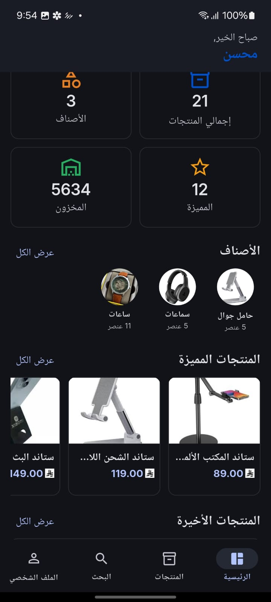
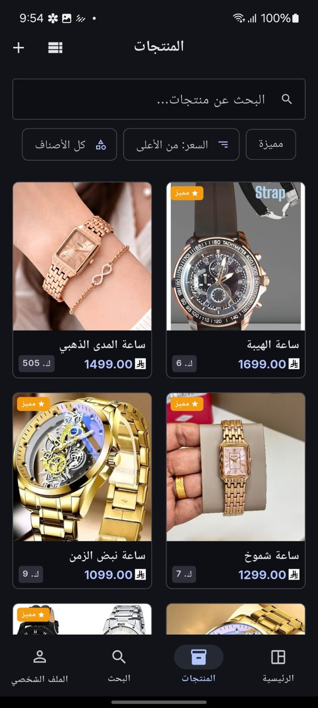

<div align="center">

# Products Management System

**A production-deployed, full-stack product management platform: Flutter mobile app · React web dashboard · Node.js REST API · PostgreSQL · Firebase Storage**

[](https://flutter.dev)
[](https://react.dev)
[](https://www.typescriptlang.org)
[](https://nodejs.org)
[](https://www.postgresql.org)
[](https://firebase.google.com)
[](https://www.docker.com)
[](https://railway.app)
[](https://vercel.com)

---

**[Live Web App](https://products-management-tan.vercel.app)** &nbsp;·&nbsp;
**[API Docs — Swagger](https://product-management-production-0052.up.railway.app/api-docs/#)** &nbsp;·&nbsp;
**[UI/UX Design — Figma](https://www.figma.com/design/jFjHVsFIkInzs5bVlQQoaj/product-management-mobile-app?node-id=0-1&p=f)**

</div>

---

## Table of Contents

- [About the Project](#about-the-project)
- [Screenshots](#screenshots)
  - [Mobile App](#mobile-app)
  - [Web Dashboard](#web-dashboard)
- [Features](#features)
- [Architecture](#architecture)
- [Tech Stack](#tech-stack)
- [Project Structure](#project-structure)
- [Database Design](#database-design)
- [Local Development](#local-development)
- [Deployment](#deployment)
- [Environment Variables](#environment-variables)
- [API Documentation](#api-documentation)
- [Roadmap](#roadmap)
- [Code Quality](#code-quality)
- [Project Journey](#project-journey)
- [Documentation](#documentation)

---

## About the Project

Products Management is a complete product management system built end-to-end by a single engineer — from requirements analysis and UX design in Figma, through a secure REST API with Swagger documentation, all the way to a cross-platform Flutter mobile app and a React web dashboard. The entire system is deployed and running in production.

The project was driven by a deliberate engineering mindset: first understand the problem, design the data model, then build each layer incrementally with quality — not just feature velocity.

### What distinguishes this project

| Aspect | Detail |
|---|---|
| **Full-stack ownership** | Every layer designed and built independently — DB, API, mobile, web |
| **Live in production** | API on Railway, web on Vercel, images on Firebase Storage |
| **Design-first** | All screens designed in Figma with a complete Design System before any code |
| **Beyond requirements** | Added categories, featured products, search history, soft-delete, image galleries, and bilingual support on top of the core spec |
| **Documented** | Swagger API docs, ERD, architecture diagrams, 8 Architecture Decision Records, and a deployment guide |
| **Secure** | JWT + refresh tokens, bcrypt hashing, rate limiting, Helmet, input validation, UUID PKs |

---

## Screenshots

### Mobile App

| Dashboard | Dashboard (Stats) |
|:---------:|:-----------------:|
|  |  |

| Products | Product Details |
|:--------:|:---------------:|
|  |  |

| Categories | Add Category |
|:----------:|:------------:|
|  |  |

| Add Product | Search |
|:-----------:|:------:|
|  |  |

| Profile |
|:-------:|
|  |

| Dark Mode — Dashboard | Dark Mode — Products |
|:---------------------:|:--------------------:|
|  |  |

---

### Web Dashboard

| Dashboard | Dashboard (Charts) |
|:---------:|:-----------------:|
|  |  |

| Dashboard Dark Mode | Products |
|:-------------------:|:--------:|
|  |  |

| Product Details | Profile |
|:---------------:|:-------:|
|  |  |

| Search |
|:------:|
|  |

---

## Features

### Authentication

| Feature | Status |
|---|---|
| User Registration | ✅ Implemented |
| User Login | ✅ Implemented |
| User Logout | ✅ Implemented |
| JWT Access Token | ✅ Implemented |
| Refresh Token | ✅ Implemented |
| Secure Token Storage (Mobile) | ✅ `flutter_secure_storage` |

### Products

| Feature | Status |
|---|---|
| Create Product | ✅ Implemented |
| Edit Product | ✅ Implemented |
| Soft Delete | ✅ `is_active` flag |
| List with Pagination | ✅ Implemented |
| Full-Text Search (`pg_trgm`) | ✅ Implemented |
| Filter by Category | ✅ Implemented |
| Filter by Price Range | ✅ Implemented |
| Featured Products | ✅ Implemented |
| Multi-Image Gallery | ✅ `product_images` table |
| Thumbnail Image | ✅ Separate `thumbnail_image_url` |
| Firebase Storage Upload | ✅ Implemented |

### Categories

| Feature | Status |
|---|---|
| Create Category | ✅ Implemented |
| Edit Category | ✅ Implemented |
| Delete (Products → Uncategorized) | ✅ `ON DELETE SET NULL` |
| Activate / Deactivate | ✅ `is_active` flag |
| Category Image | ✅ Implemented |

### Profile

| Feature | Status |
|---|---|
| View Profile | ✅ Implemented |
| Update Name | ✅ Implemented |
| Update Profile Image | ✅ Implemented |

### Search History

| Feature | Status |
|---|---|
| Persist Search Terms | ✅ Implemented |
| List Recent Searches | ✅ Implemented |
| Delete Single Entry | ✅ Implemented |
| Clear All History | ✅ Implemented |

### Platform & UX

| Feature | Status |
|---|---|
| Arabic Localization | ✅ Implemented |
| English Localization | ✅ Implemented |
| RTL Layout Support | ✅ Implemented |
| Light Theme | ✅ Implemented |
| Dark Theme | ✅ Implemented |
| Responsive Web Layout | ✅ Implemented |

---

## Architecture

### High-Level System Architecture

```
┌───────────────────────────────────────────────────────────────────┐
│                          CLIENT LAYER                             │
│                                                                   │
│  ┌───────────────────────────┐    ┌──────────────────────────┐   │
│  │    Flutter Mobile App     │    │   React Web Dashboard    │   │
│  │                           │    │                          │   │
│  │  BLoC / Cubit             │    │  TanStack Query          │   │
│  │  GoRouter + Auth Guard    │    │  React Router v7         │   │
│  │  GetIt (DI)               │    │  MUI v9                  │   │
│  │  Dio + Interceptors       │    │  Axios + i18next         │   │
│  │  Easy Localization (AR/EN)│    │  Zod + React Hook Form   │   │
│  └─────────────┬─────────────┘    └─────────────┬────────────┘   │
└────────────────│──────────────────────────────── │───────────────┘
                 │  HTTPS / REST                   │  HTTPS / REST
                 └──────────────────┬──────────────┘
                                    │
┌───────────────────────────────────▼───────────────────────────────┐
│                          API LAYER                                │
│              Node.js + Express — Modular Architecture             │
│                                                                   │
│   ┌──────────┐ ┌──────────┐ ┌──────────┐ ┌──────────┐           │
│   │   auth   │ │  users   │ │ products │ │categories│           │
│   └──────────┘ └──────────┘ └──────────┘ └──────────┘           │
│                      ┌──────────────────┐                        │
│                      │  search-history  │                        │
│                      └──────────────────┘                        │
│                                                                   │
│  Middleware:  JWT Auth · Rate Limit · CORS · Helmet · Multer     │
│  Storage:     Firebase Admin SDK → Firebase Storage              │
│  API Docs:    Swagger OpenAPI — /api-docs                        │
└───────────────────────────────────┬───────────────────────────────┘
                                    │  pg driver (SSL in production)
┌───────────────────────────────────▼───────────────────────────────┐
│                          DATA LAYER                               │
│          PostgreSQL 17 — UUID PKs · pg_trgm GIN indexes           │
│                                                                   │
│   users · categories · products · product_images · search_history │
└───────────────────────────────────────────────────────────────────┘
```

### Mobile App — Clean Architecture (Feature-First)

```
apps/mobile/lib/
├── core/
│   ├── di/              # GetIt service locator setup
│   ├── network/         # Dio client + Auth / Error / Logging interceptors
│   ├── router/          # GoRouter + redirect-based auth guard
│   ├── storage/         # flutter_secure_storage wrapper
│   └── theme/           # AppColors, AppTextStyles, AppTheme (light + dark)
│
├── features/
│   ├── auth/
│   │   ├── data/        # DTOs, AuthRemoteDataSource, AuthRepositoryImpl
│   │   ├── domain/      # UserModel, AuthResult, IAuthRepository
│   │   └── presentation/# AuthCubit, AuthState, Login/Register/Splash screens
│   │
│   ├── products/        # Same three-layer structure per feature
│   ├── categories/
│   ├── dashboard/
│   ├── profile/
│   └── search/
│
└── shared/
    └── widgets/         # AppButton, AppCard, AppTextField, AppNetworkImage, …
```

### Web App — Feature-Based Architecture

```
apps/web/src/
├── core/
│   ├── api/             # Axios instance with auth interceptor
│   ├── i18n/            # i18next setup (AR + EN)
│   ├── router/          # React Router v7 + protected routes
│   ├── theme/           # MUI theme provider + ThemeContext
│   └── query/           # TanStack Query client provider
│
├── features/
│   ├── auth/            # AuthContext, LoginPage, RegisterPage
│   ├── products/        # ProductsPage, ProductDetailPage, Create/Edit pages
│   ├── categories/      # CategoriesPage, Create/Edit pages
│   ├── dashboard/       # DashboardPage with stats
│   ├── profile/         # ProfilePage, EditProfilePage
│   └── search/          # SearchPage with history
│
└── shared/
    ├── components/      # ConfirmDialog, ImageUpload, PageHeader, PriceDisplay, …
    ├── layouts/         # AppLayout (sidebar), AuthLayout
    └── types/           # Global TypeScript interfaces
```

### Backend — Modular Architecture

```
backend/src/
├── modules/
│   ├── auth/            # controller · service · routes · validation
│   ├── users/
│   ├── products/
│   ├── categories/
│   └── search-history/
│
├── middleware/          # auth · error · rate-limit · upload · validation
├── services/
│   └── storage/         # Firebase Storage (pluggable via storage.interface.js)
├── config/              # database · swagger · env
└── utils/               # AppError · pagination · response helpers
```

### Deployment Topology

```
GitHub (main branch)
    │
    ├──► Railway         Node.js API  (auto-deploy on push)
    │         └────────► PostgreSQL 17 (Railway plugin)
    │
    └──► Vercel          React Web App (auto-deploy on push)

Firebase Storage ◄────── API (image uploads via Firebase Admin SDK)

Mobile App ──► flutter build apk --release
```

---

## Tech Stack

### Frontend — Mobile

| Technology | Version | Purpose |
|---|---|---|
| Flutter | SDK ^3.8.1 | Cross-platform mobile framework |
| flutter_bloc | ^9.0.0 | State management — BLoC / Cubit pattern |
| go_router | ^14.0.0 | Declarative routing with auth redirect |
| get_it | ^8.0.0 | Service locator / dependency injection |
| dio | ^5.7.0 | HTTP client with interceptor chain |
| flutter_secure_storage | ^9.2.0 | Encrypted JWT token persistence |
| easy_localization | ^3.0.7 | i18n — Arabic + English with RTL |
| image_picker | ^1.2.1 | Camera and gallery image selection |
| equatable | ^2.0.5 | Value equality for domain models |

### Frontend — Web

| Technology | Version | Purpose |
|---|---|---|
| React | ^19.2.6 | UI framework |
| TypeScript | ~6.0.2 | Static typing across the entire codebase |
| Vite | ^8.0.12 | Build tool and fast dev server |
| MUI (Material UI) | ^9.1.1 | Component library with theming |
| TanStack Query | ^5.101.0 | Server state, caching, and invalidation |
| React Router | ^7.17.0 | Client-side routing |
| Axios | ^1.17.0 | HTTP client |
| React Hook Form | ^7.78.0 | Performant form state management |
| Zod | ^4.4.3 | Schema-based type-safe validation |
| i18next | ^26.3.1 | Internationalization — Arabic + English |
| stylis-plugin-rtl | ^2.1.1 | RTL CSS direction for MUI components |

### Backend

| Technology | Version | Purpose |
|---|---|---|
| Node.js | >=20.0.0 | Runtime |
| Express | ^4.19.2 | Web framework |
| PostgreSQL | 17 | Relational database |
| pg | ^8.12.0 | PostgreSQL driver (SSL in production) |
| jsonwebtoken | ^9.0.2 | JWT access + refresh token issuance |
| bcryptjs | ^2.4.3 | Password hashing |
| firebase-admin | ^12.0.0 | Firebase Storage SDK |
| multer | ^1.4.5-lts.1 | Multipart file upload handling |
| express-validator | ^7.1.0 | Request input validation |
| express-rate-limit | ^7.3.1 | Brute-force and API abuse protection |
| helmet | ^7.1.0 | Security HTTP response headers |
| swagger-ui-express | ^5.0.1 | Auto-generated interactive API docs |
| morgan | ^1.10.0 | HTTP request logging |

### Infrastructure

| Service | Purpose |
|---|---|
| Docker + Docker Compose | Reproducible local PostgreSQL 17 environment |
| Railway | Production API hosting + managed PostgreSQL |
| Firebase Storage | Cloud image hosting via Admin SDK |
| Vercel | Web app hosting with edge CDN |
| GitHub | Version control and auto-deploy trigger |

---

## Project Structure

```
product-management/
├── apps/
│   ├── mobile/               Flutter mobile application
│   │   ├── lib/
│   │   │   ├── core/         DI, networking, routing, theme, storage
│   │   │   ├── features/     auth, products, categories, dashboard, profile, search
│   │   │   └── shared/       Reusable widgets
│   │   ├── assets/
│   │   │   ├── fonts/        Inter + JetBrainsMono
│   │   │   ├── icons/
│   │   │   └── translations/ en.json · ar.json
│   │   └── pubspec.yaml
│   │
│   └── web/                  React web dashboard
│       ├── src/
│       │   ├── core/         api, i18n, router, theme, query provider
│       │   ├── features/     auth, products, categories, dashboard, profile, search
│       │   └── shared/       components, layouts, types
│       ├── public/
│       │   └── locales/      en/common.json · ar/common.json
│       └── package.json
│
├── backend/                  Node.js REST API
│   ├── src/
│   │   ├── modules/          auth, users, products, categories, search-history
│   │   ├── middleware/       auth, error, rate-limit, upload, validation
│   │   ├── services/         Firebase Storage (pluggable interface)
│   │   ├── config/           database, swagger, env
│   │   └── utils/            AppError, pagination, response helpers
│   ├── .env.example
│   └── package.json
│
├── database/
│   ├── schema.sql            Full PostgreSQL 17 schema with indexes and triggers
│   ├── seed.sql              Development seed data
│   ├── erd.md                Entity-Relationship Diagram
│   └── migrations/           Incremental migration scripts
│
├── docs/
│   ├── architecture.md       System architecture, auth flow, ADR rationale
│   ├── api.md                REST API reference with examples
│   ├── deployment.md         Local, Railway, and Vercel deployment guide
│   ├── decisions.md          Architecture Decision Records (8 ADRs)
│   └── PROJECT_JOURNEY_AR.md Full project narrative (Arabic)
│
├── screenshots/
│   ├── mobile/               9 annotated mobile screenshots
│   └── web/                  7 annotated web screenshots
│
├── docker/
│   └── postgres/
│       └── postgresql.conf   Tuned PostgreSQL configuration
│
└── docker-compose.yml        Local development orchestration
```

---

## Database Design

### Schema Overview

PostgreSQL 17 with 5 tables, UUID v4 primary keys throughout, `pg_trgm` GIN indexes for full-text search, and `TIMESTAMPTZ` columns with an auto-update trigger for `updated_at`.

```
users (1)
 ├── categories (N)   ON DELETE CASCADE
 ├── products (N)     ON DELETE CASCADE
 │    └── product_images (N)  ON DELETE CASCADE
 └── search_history (N)  ON DELETE CASCADE

categories (1) ──► products (N)   ON DELETE SET NULL
                   (products become uncategorized, not deleted)
```

### Tables at a Glance

| Table | Key Columns | Notes |
|---|---|---|
| `users` | id, name, email, password_hash, profile_image_url, is_active | UNIQUE on email; partial index for active-user login |
| `categories` | id, user_id, name, description, image_url, is_active | GIN trigram index on `name` |
| `products` | id, user_id, category_id, name, price, quantity, is_featured, is_active | GIN trigram on `name` + `description`; partial indexes for active and featured |
| `product_images` | id, product_id, image_url, display_order | Composite index for ordered gallery fetch |
| `search_history` | id, user_id, search_term, searched_at | Composite index `(user_id, searched_at DESC)` |

### Soft Activation

Every primary entity (`users`, `categories`, `products`) carries `is_active BOOLEAN NOT NULL DEFAULT TRUE`. Setting it `FALSE` deactivates the record without a physical delete — preserving referential integrity, enabling future audit trails, and making accidental deletion a one-row `UPDATE` to reverse.

> Full ERD with constraints and index summary: [`database/erd.md`](database/erd.md)

---

## Local Development

### Prerequisites

| Tool | Version |
|---|---|
| Docker Desktop | Latest |
| Node.js | 20+ |
| Flutter SDK | 3.x (Dart ^3.8.1) |
| Git | Any |

### 1. Clone

```bash
git clone https://github.com/MohsenBahaj/product-management.git
cd product-management
```

### 2. Start Database (Docker)

```bash
docker compose up postgres -d
```

PostgreSQL 17 starts on port `5432`. `database/schema.sql` and `database/seed.sql` are applied automatically on first run.

### 3. Configure and Run the Backend

```bash
cd backend
cp .env.example .env
# Edit .env — DB vars default to Docker values.
# Set JWT_SECRET, JWT_REFRESH_SECRET, and Firebase credentials.

npm install
npm run dev
# API:     http://localhost:3001
# Swagger: http://localhost:3001/api-docs
```

### 4. Run the Web App

```bash
cd apps/web
npm install
npm run dev
# http://localhost:5173
```

### 5. Run the Mobile App

```bash
cd apps/mobile
flutter pub get
flutter run
```

---

## Deployment

### Live Services

| Layer | Platform | URL |
|---|---|---|
| Web App | Vercel | https://products-management-tan.vercel.app |
| REST API | Railway | https://product-management-production-0052.up.railway.app |
| API Docs | Railway (Swagger) | https://product-management-production-0052.up.railway.app/api-docs/# |
| Database | Railway PostgreSQL | Provisioned automatically |
| Images | Firebase Storage | GCP bucket (configured via env vars) |

### Backend → Railway

1. Push to GitHub.
2. Create a Railway project → add **PostgreSQL** plugin (auto-injects `DATABASE_URL`).
3. Add a **Node.js** service with root directory `backend/`.
4. Set the environment variables listed in the next section.
5. Railway auto-deploys on every `main` push.

Run the schema on a fresh database via Railway's built-in terminal:

```bash
psql $DATABASE_URL -f database/schema.sql
```

### Web App → Vercel

1. Import the repo in Vercel.
2. Set **Root Directory** to `apps/web`.
3. Build command: `npm run build` — output: `dist`.
4. Set `VITE_API_URL` to the Railway API URL.
5. Vercel auto-deploys on every `main` push.

### Mobile App → Android APK

```bash
cd apps/mobile
flutter build apk --release
# Output: build/app/outputs/flutter-apk/app-release.apk
```

---

## Environment Variables

### Backend (`backend/.env`)

| Variable | Required | Default | Description |
|---|---|---|---|
| `NODE_ENV` | ✅ | `development` | Set to `production` on Railway |
| `PORT` | auto | `3001` | Auto-injected by Railway |
| `DATABASE_URL` | ✅ | Docker default | Auto-injected by Railway PostgreSQL |
| `JWT_SECRET` | ✅ | — | Min 64-character random string |
| `JWT_EXPIRES_IN` | | `7d` | Access token lifetime |
| `JWT_REFRESH_SECRET` | ✅ | — | Must differ from `JWT_SECRET` |
| `JWT_REFRESH_EXPIRES_IN` | | `30d` | Refresh token lifetime |
| `CORS_ORIGINS` | ✅ | `localhost` | Vercel URL in production (comma-separated) |
| `UPLOAD_MAX_SIZE_MB` | | `5` | Maximum file upload size |
| `FIREBASE_PROJECT_ID` | ✅ | — | Firebase project ID |
| `FIREBASE_CLIENT_EMAIL` | ✅ | — | Service account email |
| `FIREBASE_PRIVATE_KEY` | ✅ | — | Service account private key |
| `FIREBASE_STORAGE_BUCKET` | ✅ | — | GCS bucket name |
| `AUTH_RATE_LIMIT_MAX` | | `5` | Max auth attempts per window |
| `AUTH_RATE_LIMIT_WINDOW` | | `15` | Rate limit window in minutes |
| `API_RATE_LIMIT_MAX` | | `100` | Max general API requests per window |
| `API_RATE_LIMIT_WINDOW` | | `15` | Rate limit window in minutes |

### Web App (`apps/web/.env`)

| Variable | Required | Description |
|---|---|---|
| `VITE_API_URL` | ✅ | Railway API base URL, e.g. `https://…railway.app/api` |

> Template: [`backend/.env.example`](backend/.env.example)

---

## API Documentation

The REST API is fully documented with Swagger OpenAPI. Every endpoint includes request/response schemas, authentication requirements, query parameters, and error codes.

**Live Interactive Docs:** [https://product-management-production-0052.up.railway.app/api-docs/#](https://product-management-production-0052.up.railway.app/api-docs/#)

### Endpoints at a Glance

| Module | Method | Path | Auth |
|---|---|---|---|
| **Auth** | POST | `/api/auth/register` | — |
| | POST | `/api/auth/login` | — |
| | POST | `/api/auth/logout` | ✅ |
| | POST | `/api/auth/refresh` | — |
| **Users** | GET | `/api/users/me` | ✅ |
| | PATCH | `/api/users/me` | ✅ |
| **Products** | GET | `/api/products` | ✅ |
| | POST | `/api/products` | ✅ |
| | GET | `/api/products/:id` | ✅ |
| | PATCH | `/api/products/:id` | ✅ |
| | DELETE | `/api/products/:id` | ✅ |
| **Categories** | GET | `/api/categories` | ✅ |
| | POST | `/api/categories` | ✅ |
| | GET | `/api/categories/:id` | ✅ |
| | PATCH | `/api/categories/:id` | ✅ |
| | DELETE | `/api/categories/:id` | ✅ |
| **Search History** | GET | `/api/search-history` | ✅ |
| | DELETE | `/api/search-history` | ✅ |
| | DELETE | `/api/search-history/:id` | ✅ |

### Product List Query Parameters

| Param | Type | Description |
|---|---|---|
| `q` | string | Full-text search on name + description |
| `categoryId` | UUID | Filter by category |
| `minPrice` | number | Minimum price |
| `maxPrice` | number | Maximum price |
| `page` | number | Page number (default: 1) |
| `limit` | number | Items per page (default: 20, max: 100) |
| `sortBy` | string | `created_at` \| `price` \| `name` |
| `order` | string | `asc` \| `desc` |

### Standard Error Format

```json
{
  "error": {
    "code": "VALIDATION_ERROR",
    "message": "Human-readable description",
    "details": [{ "field": "email", "message": "Invalid email format" }]
  }
}
```

| HTTP | Code | Meaning |
|---|---|---|
| 400 | `VALIDATION_ERROR` | Invalid request body or parameters |
| 401 | `UNAUTHORIZED` | Missing or expired token |
| 403 | `FORBIDDEN` | Authenticated but not permitted |
| 404 | `NOT_FOUND` | Resource not found |
| 409 | `CONFLICT` | Duplicate record (e.g. email already exists) |
| 429 | `RATE_LIMIT_EXCEEDED` | Too many requests |
| 500 | `INTERNAL_ERROR` | Server-side error |

> Full reference with request/response examples: [`docs/api.md`](docs/api.md)

---

## Roadmap

### Completed

| | Feature | Details |
|---|---|---|
| ✅ | User Authentication | Register · Login · Logout · JWT + Refresh Tokens |
| ✅ | Product Management | Full CRUD · Featured Flag · Multi-Image Gallery · Soft Delete |
| ✅ | Category Management | Full CRUD · Image Upload · Activation Toggle · Safe Uncategorize |
| ✅ | Search with History | `pg_trgm` full-text search · Persistent history per user |
| ✅ | Profile Management | View · Update name · Update profile image |
| ✅ | Firebase Storage | Production image hosting via Firebase Admin SDK |
| ✅ | Bilingual Support | Arabic (RTL) + English on both web and mobile |
| ✅ | Dark / Light Theme | System-aware theming across both platforms |
| ✅ | Swagger API Docs | All endpoints documented and live |
| ✅ | Dockerized Dev DB | One-command PostgreSQL setup |
| ✅ | Production Deployment | Railway (API + DB) + Vercel (Web) |

### Planned

| | Feature | Description |
|---|---|---|
| ☐ | Email OTP Verification | Send a one-time code on registration; require account activation before first login |
| ☐ | Forgot Password Flow | Request OTP via email, reset password securely without exposing credentials |
| ☐ | Admin Dashboard | System-wide user and content management with visibility into all records |
| ☐ | Push Notifications | Real-time in-app alerts and push notifications for key product and account events |
| ☐ | Analytics & Reports | Product views, sales trends, usage heatmaps, and exportable summaries |
| ☐ | Audit Logs | Timestamped trail of every create / update / delete operation with actor ID |
| ☐ | Advanced Reporting | Exportable reports in CSV and PDF for products, categories, and user activity |
| ☐ | Multi-Role Authorization | Admin · Content Manager · Standard User — with fine-grained permission checks |
| ☐ | Email Notifications | Transactional emails for registration, password reset, and key account events |
| ☐ | iOS Build & Distribution | Apple Developer account setup, TestFlight, and App Store submission |

---

## Code Quality

### Architectural Principles

**Mobile (Flutter) — Clean Architecture**

- Strict `data → domain → presentation` separation enforced per feature
- All state lives in Cubits — zero business logic inside widgets
- `GetIt` service locator as the single DI mechanism; no direct instantiation in the UI layer
- Interceptor chain handles token injection, error normalization, and request logging — controllers stay clean
- GoRouter `redirect` guard prevents unauthenticated navigation declaratively at the routing level
- Widgets exceeding 150 lines are extracted; screens exceeding 300 lines are split into smaller widget files

**Web (React) — Feature-Based Architecture**

- Each domain area is self-contained: its own pages, API client, hooks, and types
- TanStack Query manages all server state — automatic caching, background refetch, and optimistic updates
- React Hook Form + Zod provide type-safe, schema-driven validation at the form boundary
- `AuthContext` manages the full token lifecycle; all protected routes redirect through a single auth check
- `stylis-plugin-rtl` adapts all MUI styles for Arabic RTL layout automatically

**Backend (Node.js) — Modular REST API**

- Each module owns its controller, service, routes, and validation — no cross-module imports
- Storage is abstracted behind `storage.interface.js` — Firebase can be replaced with S3 or Cloudinary without changing any API surface
- All errors are caught and normalized through `error.middleware.js` with a consistent JSON response shape
- Input validation runs in dedicated middleware before any controller logic executes
- Rate limiting is applied at two levels: strict on `/auth/*` (5/15 min) to block brute-force, broader on the general API (100/15 min) to prevent runaway clients

### Security Measures

| Measure | Implementation |
|---|---|
| Password hashing | `bcryptjs` with configurable salt rounds |
| Stateless authentication | JWT access tokens (7d) + refresh tokens (30d) |
| Security HTTP headers | `helmet` middleware applied globally |
| Brute-force protection | `express-rate-limit` — 5 attempts per 15 min on `/auth/*` |
| Input sanitization | `express-validator` on every write endpoint |
| CORS | Whitelist-only origins; explicit pre-flight handling |
| No sequential ID exposure | UUID v4 primary keys throughout |
| Soft deletion | `is_active` flag — no accidental permanent data loss |

---

## Project Journey

This project was built following a disciplined, phase-by-phase process — not code-first.

| Phase | What happened |
|---|---|
| **1 — Requirements** | Analyzed the spec and identified what to add beyond the minimum: categories, featured products, search history, soft-delete, image galleries, and bilingual support |
| **2 — UX Design** | Designed every screen in Figma with a complete Design System (colors, typography, buttons, cards, spacing) — used Google Stitch AI to accelerate wireframing |
| **3 — Database** | Defined the ERD, chose UUID PKs, `pg_trgm` for search, partial indexes for performance, and `is_active` soft-delete over `deleted_at` |
| **4 — Dev Environment** | Set up Docker Compose for a reproducible local PostgreSQL instance |
| **5 — Firebase Storage** | Integrated Firebase Admin SDK; tested upload, serve, and delete before proceeding |
| **6 — Backend** | Built the API module by module — auth → users → categories → products → search history — with Swagger documentation throughout |
| **7 — Mobile App** | Built the Flutter app feature by feature: Clean Architecture, Cubit, GoRouter, GetIt, Dio interceptors, Easy Localization |
| **8 — Web Dashboard** | Built the React dashboard with feature parity: TanStack Query, MUI v9, React Hook Form + Zod, bilingual RTL |
| **9 — Deployment** | Deployed API + PostgreSQL to Railway, web to Vercel, images to Firebase Storage |

> Read the full project narrative (Arabic): [`docs/PROJECT_JOURNEY_AR.md`](docs/PROJECT_JOURNEY_AR.md)

---

## Documentation

| Document | Description |
|---|---|
| [Project Journey](docs/PROJECT_JOURNEY_AR.md) | Full narrative of the build process from requirements to deployment (Arabic) |
| [System Architecture](docs/architecture.md) | Architecture diagrams, module responsibilities, auth flow, rate limiting, and deployment topology |
| [API Reference](docs/api.md) | All REST endpoints with request/response examples and error codes |
| [Database ERD](database/erd.md) | Entity-Relationship Diagram with constraints, relationships, and index summary |
| [Database Schema](database/schema.sql) | Full PostgreSQL 17 DDL with triggers, indexes, and extensions |
| [Architecture Decisions](docs/decisions.md) | 8 ADRs covering UUID PKs, pg_trgm search, soft-delete strategy, JWT design, and deployment choices |
| [Deployment Guide](docs/deployment.md) | Step-by-step local, Railway, and Vercel deployment instructions |
| [Swagger UI — Live](https://product-management-production-0052.up.railway.app/api-docs/#) | Interactive API documentation |
| [Figma Design](https://www.figma.com/design/jFjHVsFIkInzs5bVlQQoaj/product-management-mobile-app?node-id=0-1&p=f) | Mobile + Web UI/UX screens and Design System |

---

<div align="center">

Built with intention by **[Mohsen Bahaj](https://github.com/MohsenBahaj)**

</div>
