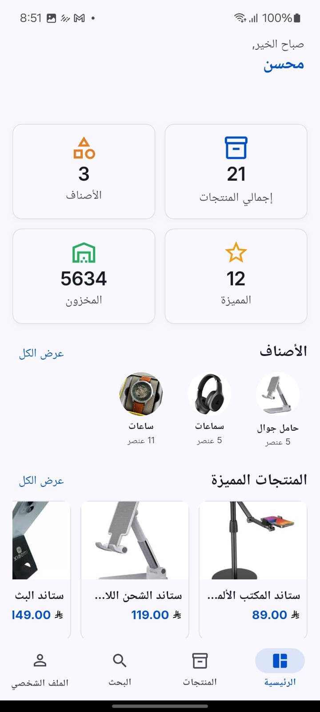
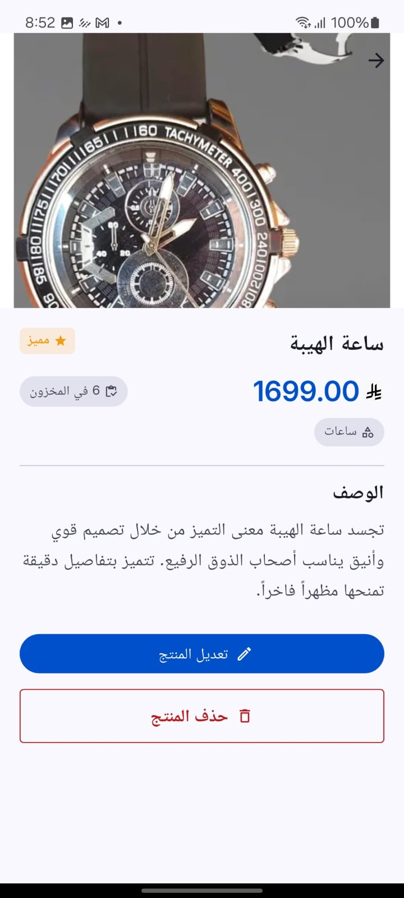
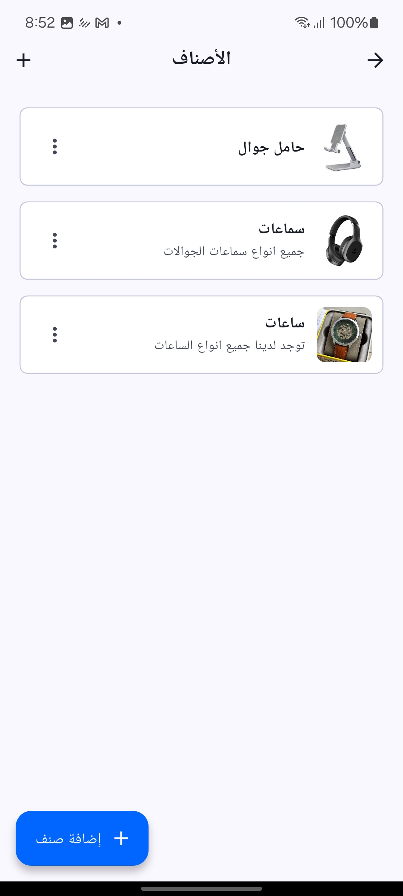
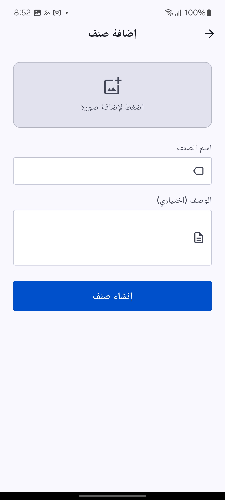
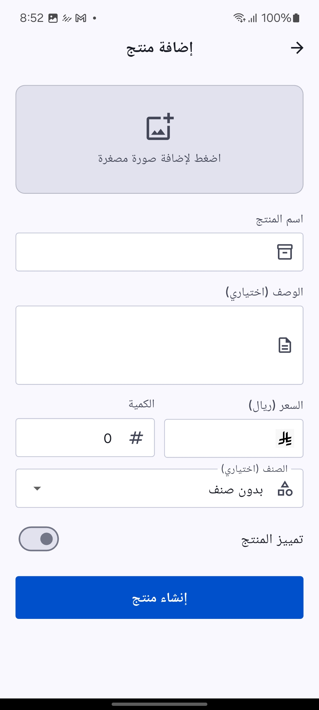
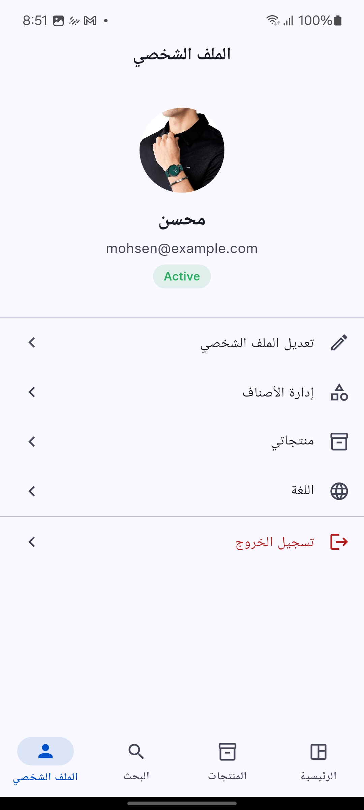
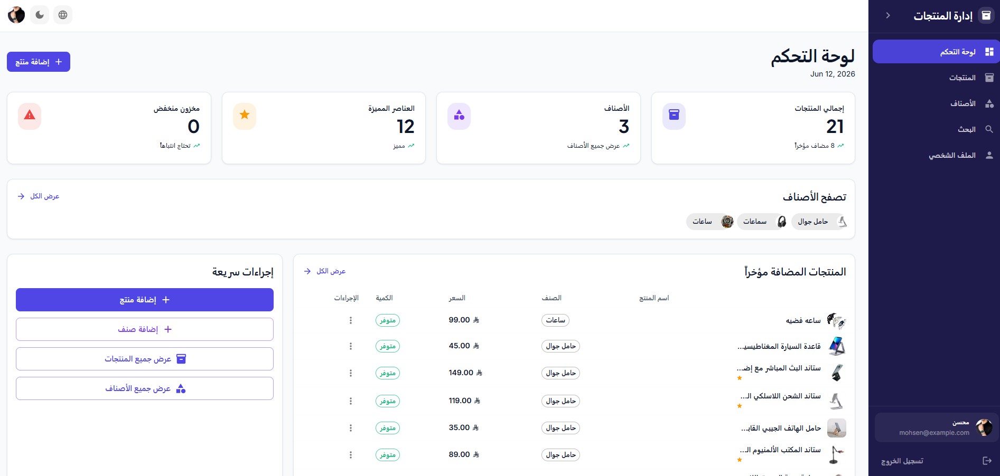

<div align="center" dir="rtl">

# StockFlow — نظام إدارة المنتجات

**منصة إدارة منتجات متكاملة ومنشورة في بيئة إنتاج حقيقية: تطبيق جوال Flutter · لوحة تحكم React · واجهة برمجية Node.js · PostgreSQL · Firebase Storage**

[](https://flutter.dev)
[](https://react.dev)
[](https://www.typescriptlang.org)
[](https://nodejs.org)
[](https://www.postgresql.org)
[](https://firebase.google.com)
[](https://www.docker.com)
[](https://railway.app)
[](https://vercel.com)

---

**[تطبيق الويب المباشر](https://products-management-tan.vercel.app)** &nbsp;·&nbsp;
**[توثيق الـ API — Swagger](https://product-management-production-0052.up.railway.app/api-docs/#)** &nbsp;·&nbsp;
**[تصميم الواجهات — Figma](https://www.figma.com/design/jFjHVsFIkInzs5bVlQQoaj/product-management-mobile-app?node-id=0-1&p=f)**

</div>

---

<div dir="rtl">

## فهرس المحتويات

- [نبذة عن المشروع](#نبذة-عن-المشروع)
- [لقطات الشاشة](#لقطات-الشاشة)
  - [تطبيق الجوال](#تطبيق-الجوال)
  - [لوحة تحكم الويب](#لوحة-تحكم-الويب)
- [الميزات المنجزة](#الميزات-المنجزة)
- [المعمارية](#المعمارية)
- [التقنيات المستخدمة](#التقنيات-المستخدمة)
- [هيكلية المشروع](#هيكلية-المشروع)
- [تصميم قاعدة البيانات](#تصميم-قاعدة-البيانات)
- [التطوير المحلي](#التطوير-المحلي)
- [النشر في الإنتاج](#النشر-في-الإنتاج)
- [متغيرات البيئة](#متغيرات-البيئة)
- [توثيق الـ API](#توثيق-الـ-api)
- [خارطة الطريق](#خارطة-الطريق)
- [جودة الكود](#جودة-الكود)
- [رحلة المشروع](#رحلة-المشروع)
- [الوثائق](#الوثائق)

---

## نبذة عن المشروع

StockFlow نظام إدارة منتجات متكامل صُمِّم وبُني من الصفر على يد مهندس واحد — بداية من تحليل المتطلبات وتصميم تجربة المستخدم في Figma، مروراً بواجهة برمجية آمنة موثقة بالكامل، وصولاً إلى تطبيق جوال Flutter ولوحة تحكم ويب مبنية بـ React. النظام كاملاً مُنشور في بيئة إنتاج حقيقية ويعمل الآن.

المشروع لم يُبنَ فقط لاستيفاء قائمة متطلبات، بل انطلق من عقلية هندسية واضحة: فهم المشكلة أولاً، ثم تصميم نموذج البيانات، ثم بناء كل طبقة تدريجياً بجودة عالية — لا مجرد سرعة في تسليم الميزات.

### ما يميز هذا المشروع

| الجانب | التفاصيل |
|---|---|
| **ملكية كاملة للمشروع** | تصميم وبناء كل طبقة باستقلالية — قاعدة بيانات، API، جوال، ويب |
| **منشور في الإنتاج** | API على Railway، تطبيق الويب على Vercel، الصور على Firebase Storage |
| **التصميم أولاً** | تصميم جميع الشاشات في Figma مع نظام تصميم متكامل قبل أي سطر كود |
| **أبعد من المتطلبات** | إضافة التصنيفات والمنتجات المميزة وسجل البحث والحذف الناعم ومعرض الصور والدعم ثنائي اللغة |
| **موثق بالكامل** | Swagger، ERD، مخططات المعمارية، 8 سجلات قرارات هندسية، ودليل نشر |
| **أمان حقيقي** | JWT + refresh tokens، تشفير كلمات المرور، تحديد معدل الطلبات، Helmet، التحقق من المدخلات، مفاتيح UUID |

---

## لقطات الشاشة

### تطبيق الجوال

| الصفحة الرئيسية | الصفحة الرئيسية (الإحصائيات) |
|:---------:|:-----------------:|
|  |  |

| المنتجات | تفاصيل المنتج |
|:--------:|:---------------:|
|  |  |

| التصنيفات | إضافة تصنيف |
|:----------:|:------------:|
|  |  |

| إضافة منتج | البحث |
|:-----------:|:------:|
|  |  |

| الملف الشخصي |
|:-------:|
|  |

---

### لوحة تحكم الويب

| لوحة التحكم | لوحة التحكم (الرسوم البيانية) |
|:---------:|:-----------------:|
|  |  |

| الوضع الداكن | المنتجات |
|:-------------------:|:--------:|
|  |  |

| تفاصيل المنتج | الملف الشخصي |
|:---------------:|:-------:|
|  |  |

| البحث |
|:------:|
|  |

---

## الميزات المنجزة

### المصادقة وإدارة الحسابات

| الميزة | الحالة |
|---|---|
| إنشاء حساب جديد | ✅ مكتمل |
| تسجيل الدخول | ✅ مكتمل |
| تسجيل الخروج | ✅ مكتمل |
| JWT Access Token | ✅ مكتمل |
| Refresh Token | ✅ مكتمل |
| تخزين آمن للرمز (جوال) | ✅ `flutter_secure_storage` |

### المنتجات

| الميزة | الحالة |
|---|---|
| إنشاء منتج | ✅ مكتمل |
| تعديل منتج | ✅ مكتمل |
| حذف ناعم (Soft Delete) | ✅ حقل `is_active` |
| عرض قائمة مع ترقيم | ✅ مكتمل |
| بحث نصي كامل (`pg_trgm`) | ✅ مكتمل |
| تصفية حسب التصنيف | ✅ مكتمل |
| تصفية حسب السعر | ✅ مكتمل |
| المنتجات المميزة | ✅ مكتمل |
| معرض صور متعدد | ✅ جدول `product_images` |
| صورة مصغرة مستقلة | ✅ حقل `thumbnail_image_url` |
| رفع الصور على Firebase | ✅ مكتمل |

### التصنيفات

| الميزة | الحالة |
|---|---|
| إنشاء تصنيف | ✅ مكتمل |
| تعديل تصنيف | ✅ مكتمل |
| حذف تصنيف (المنتجات تصبح بلا تصنيف) | ✅ `ON DELETE SET NULL` |
| تفعيل / إلغاء تفعيل | ✅ حقل `is_active` |
| صورة للتصنيف | ✅ مكتمل |

### الملف الشخصي

| الميزة | الحالة |
|---|---|
| عرض الملف الشخصي | ✅ مكتمل |
| تحديث الاسم | ✅ مكتمل |
| تحديث صورة الملف الشخصي | ✅ مكتمل |

### سجل البحث

| الميزة | الحالة |
|---|---|
| حفظ عمليات البحث | ✅ مكتمل |
| عرض آخر عمليات البحث | ✅ مكتمل |
| حذف سجل واحد | ✅ مكتمل |
| مسح جميع السجلات | ✅ مكتمل |

### تجربة المستخدم والمنصة

| الميزة | الحالة |
|---|---|
| دعم اللغة العربية (RTL) | ✅ مكتمل |
| دعم اللغة الإنجليزية | ✅ مكتمل |
| تخطيط RTL كامل | ✅ مكتمل |
| الوضع الفاتح (Light Theme) | ✅ مكتمل |
| الوضع الداكن (Dark Theme) | ✅ مكتمل |
| تصميم متجاوب للويب | ✅ مكتمل |

---

## المعمارية

### المعمارية العامة للنظام

```
┌───────────────────────────────────────────────────────────────────┐
│                          طبقة العميل                              │
│                                                                   │
│  ┌───────────────────────────┐    ┌──────────────────────────┐   │
│  │    تطبيق جوال Flutter     │    │   لوحة تحكم ويب React    │   │
│  │                           │    │                          │   │
│  │  BLoC / Cubit             │    │  TanStack Query          │   │
│  │  GoRouter + Auth Guard    │    │  React Router v7         │   │
│  │  GetIt (DI)               │    │  MUI v9                  │   │
│  │  Dio + Interceptors       │    │  Axios + i18next         │   │
│  │  Easy Localization        │    │  Zod + React Hook Form   │   │
│  └─────────────┬─────────────┘    └─────────────┬────────────┘   │
└────────────────│──────────────────────────────── │───────────────┘
                 │  HTTPS / REST                   │  HTTPS / REST
                 └──────────────────┬──────────────┘
                                    │
┌───────────────────────────────────▼───────────────────────────────┐
│                          طبقة الـ API                             │
│              Node.js + Express — معمارية وحدات مستقلة             │
│                                                                   │
│   ┌──────────┐ ┌──────────┐ ┌──────────┐ ┌──────────┐           │
│   │   auth   │ │  users   │ │ products │ │categories│           │
│   └──────────┘ └──────────┘ └──────────┘ └──────────┘           │
│                      ┌──────────────────┐                        │
│                      │  search-history  │                        │
│                      └──────────────────┘                        │
│                                                                   │
│  Middleware: JWT · Rate Limit · CORS · Helmet · Multer           │
│  التخزين: Firebase Admin SDK → Firebase Storage                  │
│  التوثيق: Swagger OpenAPI — /api-docs                            │
└───────────────────────────────────┬───────────────────────────────┘
                                    │  pg driver (SSL في الإنتاج)
┌───────────────────────────────────▼───────────────────────────────┐
│                          طبقة البيانات                            │
│          PostgreSQL 17 — UUID PKs · فهارس GIN لـ pg_trgm          │
│                                                                   │
│   users · categories · products · product_images · search_history │
└───────────────────────────────────────────────────────────────────┘
```

### تطبيق الجوال — Clean Architecture (Feature-First)

```
apps/mobile/lib/
├── core/
│   ├── di/              # GetIt — ربط جميع التبعيات
│   ├── network/         # Dio + interceptors (auth / error / logging)
│   ├── router/          # GoRouter + redirect guard للحماية
│   ├── storage/         # flutter_secure_storage للرموز الآمنة
│   └── theme/           # AppColors, AppTextStyles, AppTheme (فاتح + داكن)
│
├── features/
│   ├── auth/
│   │   ├── data/        # DTOs, RemoteDataSource, RepositoryImpl
│   │   ├── domain/      # UserModel, AuthResult, IAuthRepository
│   │   └── presentation/# AuthCubit, AuthState, شاشات الدخول والتسجيل
│   │
│   ├── products/        # نفس البنية الثلاثية لكل feature
│   ├── categories/
│   ├── dashboard/
│   ├── profile/
│   └── search/
│
└── shared/
    └── widgets/         # AppButton, AppCard, AppTextField, AppNetworkImage, …
```

### تطبيق الويب — Feature-Based Architecture

```
apps/web/src/
├── core/
│   ├── api/             # Axios مع interceptor للتوثيق
│   ├── i18n/            # إعداد i18next (عربي + إنجليزي)
│   ├── router/          # React Router v7 + مسارات محمية
│   ├── theme/           # MUI theme + ThemeContext
│   └── query/           # TanStack Query client provider
│
├── features/
│   ├── auth/            # AuthContext, صفحات الدخول والتسجيل
│   ├── products/        # قائمة المنتجات، التفاصيل، إنشاء، تعديل
│   ├── categories/      # قائمة التصنيفات، إنشاء، تعديل
│   ├── dashboard/       # لوحة التحكم مع الإحصائيات
│   ├── profile/         # الملف الشخصي، تعديل الملف
│   └── search/          # البحث مع سجل عمليات البحث
│
└── shared/
    ├── components/      # ConfirmDialog, ImageUpload, PageHeader, …
    ├── layouts/         # AppLayout (شريط جانبي), AuthLayout
    └── types/           # واجهات TypeScript المشتركة
```

### الخادم الخلفي — Modular Architecture

```
backend/src/
├── modules/
│   ├── auth/            # controller · service · routes · validation
│   ├── users/
│   ├── products/
│   ├── categories/
│   └── search-history/
│
├── middleware/          # auth · error · rate-limit · upload · validation
├── services/
│   └── storage/         # Firebase Storage (واجهة قابلة للاستبدال)
├── config/              # database · swagger · env
└── utils/               # AppError · pagination · response helpers
```

### طوبولوجيا النشر

```
GitHub (الفرع الرئيسي main)
    │
    ├──► Railway         Node.js API  (نشر تلقائي عند كل push)
    │         └────────► PostgreSQL 17 (Railway plugin)
    │
    └──► Vercel          React Web App (نشر تلقائي عند كل push)

Firebase Storage ◄────── API (رفع الصور عبر Firebase Admin SDK)

تطبيق الجوال ──► flutter build apk --release
```

---

## التقنيات المستخدمة

### الواجهة الأمامية — تطبيق الجوال

| التقنية | الإصدار | الغرض |
|---|---|---|
| Flutter | SDK ^3.8.1 | إطار عمل الجوال متعدد المنصات |
| flutter_bloc | ^9.0.0 | إدارة الحالة — نمط BLoC / Cubit |
| go_router | ^14.0.0 | التوجيه التصريحي مع حارس المصادقة |
| get_it | ^8.0.0 | حاقن التبعيات |
| dio | ^5.7.0 | HTTP client مع سلسلة interceptors |
| flutter_secure_storage | ^9.2.0 | تخزين مشفر لرموز JWT |
| easy_localization | ^3.0.7 | دعم اللغتين العربية والإنجليزية مع RTL |
| image_picker | ^1.2.1 | اختيار الصور من الكاميرا أو المعرض |
| equatable | ^2.0.5 | مساواة القيم في نماذج الـ domain |

### الواجهة الأمامية — تطبيق الويب

| التقنية | الإصدار | الغرض |
|---|---|---|
| React | ^19.2.6 | إطار عمل الواجهة |
| TypeScript | ~6.0.2 | الكتابة الساكنة في كامل الكود |
| Vite | ^8.0.12 | أداة البناء وخادم التطوير |
| MUI (Material UI) | ^9.1.1 | مكتبة المكونات مع نظام الثيمات |
| TanStack Query | ^5.101.0 | إدارة حالة الخادم والتخزين المؤقت |
| React Router | ^7.17.0 | التوجيه من جهة العميل |
| Axios | ^1.17.0 | HTTP client |
| React Hook Form | ^7.78.0 | إدارة حالة النماذج |
| Zod | ^4.4.3 | التحقق من الصحة بالمخططات |
| i18next | ^26.3.1 | الترجمة — عربي وإنجليزي |
| stylis-plugin-rtl | ^2.1.1 | دعم اتجاه RTL في مكونات MUI |

### الخادم الخلفي

| التقنية | الإصدار | الغرض |
|---|---|---|
| Node.js | >=20.0.0 | بيئة التشغيل |
| Express | ^4.19.2 | إطار الويب |
| PostgreSQL | 17 | قاعدة البيانات العلائقية |
| pg | ^8.12.0 | مشغّل PostgreSQL (SSL في الإنتاج) |
| jsonwebtoken | ^9.0.2 | إصدار رموز JWT للوصول والتحديث |
| bcryptjs | ^2.4.3 | تشفير كلمات المرور |
| firebase-admin | ^12.0.0 | Firebase Storage SDK |
| multer | ^1.4.5-lts.1 | معالجة رفع الملفات |
| express-validator | ^7.1.0 | التحقق من مدخلات الطلبات |
| express-rate-limit | ^7.3.1 | الحماية من brute-force وإساءة الاستخدام |
| helmet | ^7.1.0 | ترويسات HTTP الأمنية |
| swagger-ui-express | ^5.0.1 | توثيق API تفاعلي |
| morgan | ^1.10.0 | تسجيل طلبات HTTP |

### البنية التحتية

| الخدمة | الغرض |
|---|---|
| Docker + Docker Compose | بيئة PostgreSQL 17 محلية قابلة للتكرار |
| Railway | استضافة الـ API + PostgreSQL مُدار |
| Firebase Storage | استضافة الصور في السحابة عبر Admin SDK |
| Vercel | استضافة تطبيق الويب مع CDN |
| GitHub | إدارة الكود وتشغيل النشر التلقائي |

---

## هيكلية المشروع

```
product-management/
├── apps/
│   ├── mobile/               تطبيق Flutter للجوال
│   │   ├── lib/
│   │   │   ├── core/         DI، الشبكة، التوجيه، الثيم، التخزين
│   │   │   ├── features/     auth, products, categories, dashboard, profile, search
│   │   │   └── shared/       widgets مشتركة قابلة لإعادة الاستخدام
│   │   ├── assets/
│   │   │   ├── fonts/        Inter + JetBrainsMono
│   │   │   ├── icons/
│   │   │   └── translations/ en.json · ar.json
│   │   └── pubspec.yaml
│   │
│   └── web/                  لوحة تحكم React
│       ├── src/
│       │   ├── core/         api, i18n, router, theme, query
│       │   ├── features/     auth, products, categories, dashboard, profile, search
│       │   └── shared/       components, layouts, types
│       ├── public/
│       │   └── locales/      en/common.json · ar/common.json
│       └── package.json
│
├── backend/                  واجهة برمجية Node.js
│   ├── src/
│   │   ├── modules/          auth, users, products, categories, search-history
│   │   ├── middleware/       auth, error, rate-limit, upload, validation
│   │   ├── services/         Firebase Storage (واجهة قابلة للاستبدال)
│   │   ├── config/           database, swagger, env
│   │   └── utils/            AppError, pagination, response helpers
│   ├── .env.example
│   └── package.json
│
├── database/
│   ├── schema.sql            مخطط PostgreSQL 17 الكامل مع الفهارس والـ triggers
│   ├── seed.sql              بيانات أولية لبيئة التطوير
│   ├── erd.md                مخطط كيانات-علاقات ERD
│   └── migrations/           سكريبتات الترحيل التدريجي
│
├── docs/
│   ├── architecture.md       المعمارية والـ ADRs والتدفقات
│   ├── api.md                مرجع الـ API مع أمثلة
│   ├── deployment.md         دليل النشر خطوة بخطوة
│   ├── decisions.md          سجلات قرارات المعمارية (8 ADRs)
│   └── PROJECT_JOURNEY_AR.md رحلة المشروع كاملة (عربي)
│
├── screenshots/
│   ├── mobile/               9 لقطات شاشة للجوال
│   └── web/                  7 لقطات شاشة للويب
│
├── docker/
│   └── postgres/
│       └── postgresql.conf   إعدادات PostgreSQL المُحسَّنة
│
└── docker-compose.yml        تنسيق بيئة التطوير المحلي
```

---

## تصميم قاعدة البيانات

### نظرة عامة على المخطط

PostgreSQL 17 مع 5 جداول، مفاتيح أساسية UUID v4 في كل مكان، فهارس GIN لـ `pg_trgm` للبحث النصي الكامل دون الحاجة إلى محرك بحث خارجي، وأعمدة `TIMESTAMPTZ` مع trigger لتحديث `updated_at` تلقائياً.

```
users (1)
 ├── categories (N)       ON DELETE CASCADE
 ├── products (N)         ON DELETE CASCADE
 │    └── product_images (N)  ON DELETE CASCADE
 └── search_history (N)   ON DELETE CASCADE

categories (1) ──► products (N)   ON DELETE SET NULL
                   (المنتجات تصبح بلا تصنيف وليس حذفها)
```

### الجداول

| الجدول | الأعمدة الرئيسية | ملاحظات |
|---|---|---|
| `users` | id, name, email, password_hash, profile_image_url, is_active | UNIQUE على البريد؛ فهرس جزئي للمستخدمين النشطين |
| `categories` | id, user_id, name, description, image_url, is_active | فهرس GIN trigram على `name` |
| `products` | id, user_id, category_id, name, price, quantity, is_featured, is_active | GIN trigram على `name` + `description`؛ فهارس جزئية للنشط والمميز |
| `product_images` | id, product_id, image_url, display_order | فهرس مركب لجلب معرض الصور مرتباً |
| `search_history` | id, user_id, search_term, searched_at | فهرس مركب `(user_id, searched_at DESC)` |

### استراتيجية الحذف الناعم

كل كيان رئيسي (`users` و`categories` و`products`) يحمل `is_active BOOLEAN NOT NULL DEFAULT TRUE`. تعيين القيمة `FALSE` يوقف السجل دون حذف فعلي — مما يحافظ على سلامة المراجع، ويُتيح مسارات التدقيق مستقبلاً، ويجعل التراجع عن حذف خاطئ مجرد `UPDATE` واحد.

> مخطط ERD الكامل مع القيود والفهارس: [`database/erd.md`](database/erd.md)

---

## التطوير المحلي

### المتطلبات الأساسية

| الأداة | الإصدار |
|---|---|
| Docker Desktop | الأحدث |
| Node.js | 20+ |
| Flutter SDK | 3.x (Dart ^3.8.1) |
| Git | أي إصدار |

### 1. استنساخ المستودع

```bash
git clone https://github.com/MohsenBahaj/product-management.git
cd product-management
```

### 2. تشغيل قاعدة البيانات (Docker)

```bash
docker compose up postgres -d
```

يبدأ PostgreSQL 17 على المنفذ `5432`، ويطبّق `schema.sql` و`seed.sql` تلقائياً عند أول تشغيل.

### 3. إعداد وتشغيل الخادم الخلفي

```bash
cd backend
cp .env.example .env
# عدّل .env — متغيرات DB تعمل مع Docker افتراضياً
# اضبط JWT_SECRET وJWT_REFRESH_SECRET وبيانات Firebase

npm install
npm run dev
# API:     http://localhost:3001
# Swagger: http://localhost:3001/api-docs
```

### 4. تشغيل تطبيق الويب

```bash
cd apps/web
npm install
npm run dev
# http://localhost:5173
```

### 5. تشغيل تطبيق الجوال

```bash
cd apps/mobile
flutter pub get
flutter run
```

---

## النشر في الإنتاج

### الخدمات المباشرة

| الطبقة | المنصة | الرابط |
|---|---|---|
| تطبيق الويب | Vercel | https://products-management-tan.vercel.app |
| REST API | Railway | https://product-management-production-0052.up.railway.app |
| توثيق الـ API | Railway (Swagger) | https://product-management-production-0052.up.railway.app/api-docs/# |
| قاعدة البيانات | Railway PostgreSQL | يُنشأ تلقائياً |
| التخزين | Firebase Storage | حاوية GCP مُهيأة عبر متغيرات البيئة |

### نشر الخادم الخلفي على Railway

1. ادفع الكود إلى GitHub.
2. أنشئ مشروعاً جديداً في Railway → أضف **PostgreSQL plugin** (يحقن `DATABASE_URL` تلقائياً).
3. أضف خدمة **Node.js** مع تحديد المجلد الجذر `backend/`.
4. اضبط متغيرات البيئة الموضحة في القسم التالي.
5. Railway ينشر تلقائياً عند كل push إلى `main`.

لتطبيق المخطط على قاعدة بيانات جديدة عبر طرفية Railway:

```bash
psql $DATABASE_URL -f database/schema.sql
```

### نشر تطبيق الويب على Vercel

1. استورد المستودع في Vercel.
2. حدد **Root Directory** → `apps/web`.
3. أمر البناء: `npm run build` — المخرجات: `dist`.
4. اضبط `VITE_API_URL` بعنوان Railway API.
5. Vercel ينشر تلقائياً عند كل push إلى `main`.

### بناء تطبيق الجوال (Android)

```bash
cd apps/mobile
flutter build apk --release
# المخرجات: build/app/outputs/flutter-apk/app-release.apk
```

---

## متغيرات البيئة

### الخادم الخلفي (`backend/.env`)

| المتغير | مطلوب | الافتراضي | الوصف |
|---|---|---|---|
| `NODE_ENV` | ✅ | `development` | اضبط `production` في Railway |
| `PORT` | تلقائي | `3001` | Railway يحقنه تلقائياً |
| `DATABASE_URL` | ✅ | Docker default | Railway يحقنه عبر PostgreSQL plugin |
| `JWT_SECRET` | ✅ | — | سلسلة عشوائية بطول 64 حرفاً على الأقل |
| `JWT_EXPIRES_IN` | | `7d` | مدة صلاحية رمز الوصول |
| `JWT_REFRESH_SECRET` | ✅ | — | يجب أن يختلف عن `JWT_SECRET` |
| `JWT_REFRESH_EXPIRES_IN` | | `30d` | مدة صلاحية رمز التحديث |
| `CORS_ORIGINS` | ✅ | `localhost` | رابط Vercel في الإنتاج (يمكن فصل أكثر من رابط بفاصلة) |
| `UPLOAD_MAX_SIZE_MB` | | `5` | الحجم الأقصى للملف المرفوع |
| `FIREBASE_PROJECT_ID` | ✅ | — | معرف مشروع Firebase |
| `FIREBASE_CLIENT_EMAIL` | ✅ | — | بريد حساب الخدمة |
| `FIREBASE_PRIVATE_KEY` | ✅ | — | المفتاح الخاص لحساب الخدمة |
| `FIREBASE_STORAGE_BUCKET` | ✅ | — | اسم حاوية GCS |
| `AUTH_RATE_LIMIT_MAX` | | `5` | أقصى محاولات مصادقة في النافذة الزمنية |
| `AUTH_RATE_LIMIT_WINDOW` | | `15` | النافذة الزمنية لتحديد المعدل (دقائق) |
| `API_RATE_LIMIT_MAX` | | `100` | أقصى طلبات API في النافذة الزمنية |
| `API_RATE_LIMIT_WINDOW` | | `15` | النافذة الزمنية (دقائق) |

### تطبيق الويب (`apps/web/.env`)

| المتغير | مطلوب | الوصف |
|---|---|---|
| `VITE_API_URL` | ✅ | عنوان الـ API الكامل، مثال: `https://…railway.app/api` |

> القالب: [`backend/.env.example`](backend/.env.example)

---

## توثيق الـ API

الواجهة البرمجية موثقة بالكامل باستخدام Swagger OpenAPI. كل نقطة نهاية تتضمن مخططات الطلب والاستجابة، متطلبات المصادقة، معاملات الاستعلام، ورموز الأخطاء.

**توثيق تفاعلي مباشر:** [https://product-management-production-0052.up.railway.app/api-docs/#](https://product-management-production-0052.up.railway.app/api-docs/#)

### ملخص نقاط النهاية

| الوحدة | الطريقة | المسار | مصادقة |
|---|---|---|---|
| **Auth** | POST | `/api/auth/register` | — |
| | POST | `/api/auth/login` | — |
| | POST | `/api/auth/logout` | ✅ |
| | POST | `/api/auth/refresh` | — |
| **Users** | GET | `/api/users/me` | ✅ |
| | PATCH | `/api/users/me` | ✅ |
| **Products** | GET | `/api/products` | ✅ |
| | POST | `/api/products` | ✅ |
| | GET | `/api/products/:id` | ✅ |
| | PATCH | `/api/products/:id` | ✅ |
| | DELETE | `/api/products/:id` | ✅ |
| **Categories** | GET | `/api/categories` | ✅ |
| | POST | `/api/categories` | ✅ |
| | GET | `/api/categories/:id` | ✅ |
| | PATCH | `/api/categories/:id` | ✅ |
| | DELETE | `/api/categories/:id` | ✅ |
| **Search History** | GET | `/api/search-history` | ✅ |
| | DELETE | `/api/search-history` | ✅ |
| | DELETE | `/api/search-history/:id` | ✅ |

### صيغة الأخطاء الموحدة

```json
{
  "error": {
    "code": "VALIDATION_ERROR",
    "message": "وصف مقروء للخطأ",
    "details": [{ "field": "email", "message": "صيغة البريد الإلكتروني غير صحيحة" }]
  }
}
```

| HTTP | الكود | المعنى |
|---|---|---|
| 400 | `VALIDATION_ERROR` | بيانات طلب غير صحيحة |
| 401 | `UNAUTHORIZED` | رمز مفقود أو منتهي الصلاحية |
| 403 | `FORBIDDEN` | مصادق لكن غير مصرح |
| 404 | `NOT_FOUND` | المورد غير موجود |
| 409 | `CONFLICT` | سجل مكرر (مثل: البريد مسجل مسبقاً) |
| 429 | `RATE_LIMIT_EXCEEDED` | تجاوز الحد المسموح به من الطلبات |
| 500 | `INTERNAL_ERROR` | خطأ في الخادم |

> مرجع كامل مع أمثلة: [`docs/api.md`](docs/api.md)

---

## خارطة الطريق

### المنجز

| | الميزة | التفاصيل |
|---|---|---|
| ✅ | المصادقة | تسجيل · دخول · خروج · JWT + Refresh Tokens |
| ✅ | إدارة المنتجات | CRUD كامل · منتجات مميزة · معرض صور · حذف ناعم |
| ✅ | إدارة التصنيفات | CRUD كامل · رفع صورة · تفعيل/إلغاء · حماية المنتجات عند الحذف |
| ✅ | البحث مع السجل | بحث نصي كامل بـ `pg_trgm` · سجل بحث مستمر لكل مستخدم |
| ✅ | إدارة الملف الشخصي | العرض · تحديث الاسم · تحديث صورة الملف |
| ✅ | Firebase Storage | استضافة الصور في السحابة عبر Admin SDK |
| ✅ | دعم اللغتين | عربي (RTL) + إنجليزي في كلا التطبيقين |
| ✅ | الثيمات | وضع فاتح وداكن في كلا المنصتين |
| ✅ | توثيق Swagger | جميع نقاط النهاية موثقة ومنشورة |
| ✅ | قاعدة بيانات Docker | إعداد PostgreSQL بأمر واحد |
| ✅ | النشر في الإنتاج | Railway (API + DB) + Vercel (Web) |

### المُخطَّط

| | الميزة | الوصف |
|---|---|---|
| ☐ | التحقق عبر OTP بريدي | إرسال رمز تحقق عند التسجيل؛ تفعيل الحساب قبل أول دخول |
| ☐ | استعادة كلمة المرور | طلب OTP عبر البريد وإعادة ضبط كلمة المرور بأمان |
| ☐ | لوحة تحكم مدير النظام | إدارة المستخدمين والمحتوى على مستوى النظام |
| ☐ | الإشعارات الفورية | تنبيهات داخل التطبيق وإشعارات push للأحداث الهامة |
| ☐ | التحليلات والتقارير | مشاهدات المنتجات، اتجاهات الاستخدام، خرائط حرارية |
| ☐ | سجل العمليات | سجل مؤرخ لكل عملية إنشاء / تعديل / حذف مع هوية المنفذ |
| ☐ | تقارير متقدمة | تقارير قابلة للتصدير بصيغة CSV و PDF |
| ☐ | صلاحيات متعددة الأدوار | مدير النظام · مدير المحتوى · المستخدم العادي |
| ☐ | إشعارات البريد الإلكتروني | رسائل معاملاتية لأحداث الحساب الهامة |
| ☐ | iOS والـ App Store | إعداد Apple Developer وتجهيز TestFlight وإرسال للمتجر |

---

## جودة الكود

### المبادئ المعمارية

**تطبيق الجوال (Flutter) — Clean Architecture**

- فصل صارم `data → domain → presentation` مُطبَّق على كل feature بشكل مستقل
- كل الحالة تعيش في Cubits — لا منطق أعمال داخل الـ widgets
- `GetIt` كآلية DI وحيدة — لا instantiation مباشر في طبقة UI
- سلسلة interceptors تتولى حقن الرمز، تنظيم الأخطاء، وتسجيل الطلبات — الـ controllers تبقى نظيفة
- GoRouter `redirect` guard يمنع التنقل غير المصرح به بشكل تصريحي
- widgets تتجاوز 150 سطراً تُستخرج؛ screens تتجاوز 300 سطراً تُقسَّم

**تطبيق الويب (React) — Feature-Based Architecture**

- كل نطاق وظيفي مكتفٍ بذاته: صفحاته، API client، hooks، وأنواعه الخاصة
- TanStack Query يدير كل حالة الخادم — تخزين مؤقت تلقائي، إعادة جلب في الخلفية، وتحديثات تفاؤلية
- React Hook Form + Zod يوفران تحققاً من الصحة آمن النوع عند حدود النماذج
- `AuthContext` يدير دورة حياة الرمز بالكامل؛ جميع المسارات المحمية تعيد التوجيه عبر تحقق مصادقة واحد
- `stylis-plugin-rtl` يُكيِّف جميع أنماط MUI تلقائياً للتخطيط العربي RTL

**الخادم الخلفي (Node.js) — Modular REST API**

- كل وحدة تمتلك controller وservice وroutes وvalidation خاصة بها — لا imports مشتركة بين الوحدات
- التخزين مُجرَّد وراء `storage.interface.js` — يمكن استبدال Firebase بـ S3 أو Cloudinary دون تغيير أي سطح API
- جميع الأخطاء تُعالج وتُوحَّد عبر `error.middleware.js` بشكل JSON ثابت
- التحقق من المدخلات يعمل في middleware مستقل قبل أي منطق في الـ controller
- تحديد المعدل على مستويين: صارم على `/auth/*` (5/15 دقيقة) لمنع brute-force، وأوسع على الـ API العام (100/15 دقيقة)

### إجراءات الأمان

| الإجراء | التنفيذ |
|---|---|
| تشفير كلمات المرور | `bcryptjs` مع salt rounds قابلة للضبط |
| مصادقة عديمة الحالة | JWT access tokens (7 أيام) + refresh tokens (30 يوماً) |
| ترويسات HTTP الأمنية | middleware `helmet` مُطبَّق عالمياً |
| الحماية من brute-force | `express-rate-limit` — 5 محاولات/15 دقيقة على `/auth/*` |
| تعقيم المدخلات | `express-validator` على كل نقطة نهاية للكتابة |
| سياسة CORS | مصادر معتمدة فقط بقائمة بيضاء |
| إخفاء معرفات قواعدة البيانات | مفاتيح UUID v4 في كل مكان — لا تسرب للأرقام المتسلسلة |
| الحذف الناعم | حقل `is_active` — لا فقدان غير مقصود للبيانات |

---

## رحلة المشروع

بُني هذا المشروع وفق منهجية هندسية منضبطة — وليس بدء الكود مباشرة.

| المرحلة | ما حدث |
|---|---|
| **1 — تحليل المتطلبات** | تحليل المواصفات وتحديد ما يمكن إضافته: التصنيفات، المنتجات المميزة، سجل البحث، الحذف الناعم، معرض الصور، ودعم اللغتين |
| **2 — تصميم UX (Figma)** | تصميم جميع الشاشات في Figma مع نظام تصميم متكامل (ألوان، خطوط، أزرار، بطاقات، مسافات) — استخدام Google Stitch AI لتسريع الـ wireframing |
| **3 — تصميم قاعدة البيانات** | رسم ERD، اختيار UUID keys، `pg_trgm` للبحث، فهارس جزئية للأداء، و`is_active` للحذف الناعم |
| **4 — بيئة التطوير** | إعداد Docker Compose لبيئة PostgreSQL محلية قابلة للتكرار |
| **5 — Firebase Storage** | دمج Firebase Admin SDK؛ اختبار الرفع والعرض والحذف قبل المتابعة |
| **6 — الخادم الخلفي** | بناء الـ API وحدة بوحدة مع توثيق Swagger طوال المسير |
| **7 — تطبيق الجوال** | بناء تطبيق Flutter feature بعد feature: Clean Architecture, Cubit, GoRouter, GetIt, Dio interceptors |
| **8 — لوحة تحكم الويب** | بناء لوحة تحكم React مع تكافؤ كامل في الميزات: TanStack Query, MUI v9, React Hook Form + Zod |
| **9 — النشر** | نشر API + PostgreSQL على Railway، الويب على Vercel، الصور على Firebase Storage |

> اقرأ رحلة المشروع الكاملة: [`docs/PROJECT_JOURNEY_AR.md`](docs/PROJECT_JOURNEY_AR.md)

---

## الوثائق

| الوثيقة | الوصف |
|---|---|
| [رحلة المشروع](docs/PROJECT_JOURNEY_AR.md) | سرد كامل لمسيرة البناء من المتطلبات إلى النشر (عربي) |
| [معمارية النظام](docs/architecture.md) | مخططات النظام، مسؤوليات الوحدات، تدفق المصادقة، استراتيجية تحديد المعدل |
| [مرجع الـ API](docs/api.md) | جميع نقاط النهاية مع أمثلة الطلب والاستجابة |
| [ERD قاعدة البيانات](database/erd.md) | مخطط كيانات-علاقات مع القيود والعلاقات وملخص الفهارس |
| [مخطط قاعدة البيانات](database/schema.sql) | DDL كامل لـ PostgreSQL 17 مع triggers وفهارس وامتدادات |
| [قرارات المعمارية](docs/decisions.md) | 8 ADRs تغطي UUID PKs، بحث pg_trgm، استراتيجية الحذف الناعم، JWT، وقرارات النشر |
| [دليل النشر](docs/deployment.md) | تعليمات نشر تفصيلية للبيئة المحلية وRailway وVercel |
| [Swagger — مباشر](https://product-management-production-0052.up.railway.app/api-docs/#) | توثيق API تفاعلي |
| [تصميم Figma](https://www.figma.com/design/jFjHVsFIkInzs5bVlQQoaj/product-management-mobile-app?node-id=0-1&p=f) | شاشات UI/UX للجوال والويب ونظام التصميم |

---

</div>

<div align="center">

بُني بعناية واحتراف من قِبَل **[Mohsen Bahaj](https://github.com/MohsenBahaj)**

</div>
